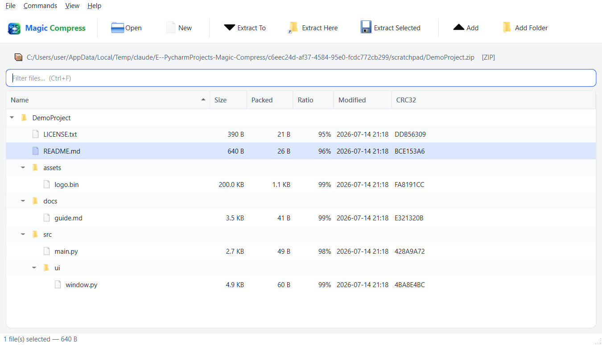
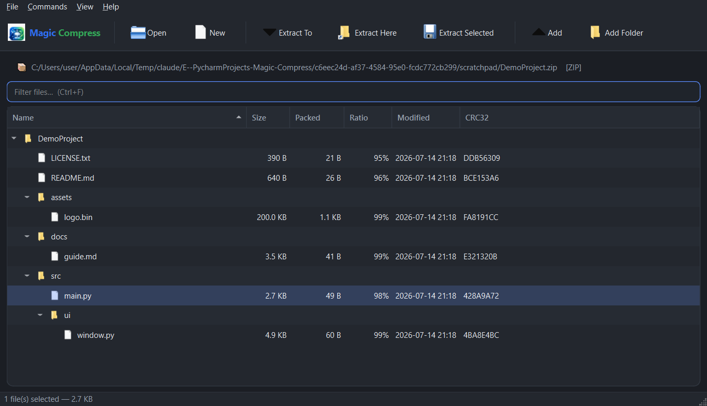

# Magic Compress

A WinRAR-style desktop archive manager built with Python and PySide6. Create,
browse, and extract compressed archives with encryption, adjustable compression,
in-place add/delete, and drag-and-drop.



## Features

- **Open & browse** any supported archive in a sortable folder tree — name,
  size, packed size, compression ratio, modified date and CRC32.
- **Filter** the file list live as you type (Ctrl+F).
- **Archive info** — one glance at file/folder counts, total and packed size,
  overall ratio, on-disk size and encryption status (Ctrl+I).
- **Create** ZIP, 7z, and TAR-family (`.tar`/`.tar.gz`/`.tar.bz2`/`.tar.xz`)
  archives from files and folders.
- **Extract** everything, just the selection, or one-click **Extract Here**
  into the archive's own folder.
- **Open Recent** — jump back to recently opened archives.
- **Convert / repackage** — turn any open archive into a different format,
  compression level, or encryption in one step (even RAR → ZIP/7z).
- **Comment** — view and edit a ZIP archive's comment (RAR comments are shown
  read-only).
- **Split into volumes** — create multi-volume 7z archives
  (`name.7z.0001`, `.0002`, …) for easier transfer; open any volume to browse
  or extract the whole set.
- **Encryption** — AES-256 for ZIP and 7z, with optional encrypted file names
  (headers) for 7z.
- **Adjustable compression** from Store (no compression) up to Maximum, with a
  post-creation summary showing original size, archive size and **% saved**.
- **Safe overwrite** — if the target archive name already exists you're asked to
  **Overwrite**, **Save As New** (auto-numbered), or **Cancel**.
- **Add / delete** files inside an existing archive.
- **Integrity test** to verify an archive is not corrupt.
- **Open a file in place** — double-click any file inside an archive to extract
  it to a temp folder and open it with your default app.
- **Right-click context menu** — Open, Extract, Delete and Test on the selection.
- **Drag-and-drop, both ways** — drop an archive to open it, or drop files onto
  an open archive to add them (or onto an empty window to start a new one); and
  **drag files/folders out** of the archive onto Explorer or the desktop to
  extract them there.
- **Light & dark themes** — toggle from the **View** menu; the choice and window
  size/position are remembered between runs.
- **Background operations** with a live progress bar and Cancel.
- **Settings** (Ctrl+,) — theme, new-archive defaults (format & compression),
  confirm-before-delete, double-click behaviour, remember-window, extract
  defaults, and an optional RAR tool path.
- **Explorer integration** (Windows) — register Magic Compress in the
  "Open with" menu and add an "Open with Magic Compress" right-click verb for
  archive types. Fully reversible, no admin required (per-user registry).

Light and dark:



### Format support at a glance

| Format               | Create | Extract | Encrypt |
|----------------------|:------:|:-------:|:-------:|
| ZIP (`.zip`)         |   ✅   |   ✅    | AES-256 |
| 7-Zip (`.7z`)        |   ✅   |   ✅    | AES-256 (+ header) |
| TAR (`.tar`)         |   ✅   |   ✅    |   —     |
| TAR.GZ / BZ2 / XZ    |   ✅   |   ✅    |   —     |
| RAR (`.rar`)         |   ❌   |   ✅*   |   ✅    |

\* **RAR** is browse/extract only. Creating `.rar` files requires WinRAR's
proprietary, non-redistributable encoder, so no open-source app can make them —
this is the same limitation 7-Zip has. Extraction needs an external `unrar`
(bundled with WinRAR) or 7-Zip on your PATH; the file listing works without it.

## Requirements

- Python 3.10+ (developed on 3.14)
- See [`requirements.txt`](requirements.txt): PySide6, pyzipper, py7zr, rarfile

## Setup & run

```bash
python -m venv .venv
.venv\Scripts\activate            # Windows
pip install -r requirements.txt
python main.py                    # or: python main.py path\to\archive.zip
```

## Building a standalone executable

To produce a single `.exe` that runs without a Python install (Windows):

```bash
pip install pyinstaller
pyinstaller MagicCompress.spec
```

The result is `dist/MagicCompress.exe`. The [spec](MagicCompress.spec) bundles the
compression backends and trims unused Qt modules to keep the binary lean.

### Windows installer

An [Inno Setup](https://jrsoftware.org/isinfo.php) script builds a proper
installer with Start-menu/desktop shortcuts and optional Explorer integration:

```bash
pyinstaller MagicCompress.spec                        # 1. build the exe
iscc installer\MagicCompress.iss                      # 2. build the installer
```

This produces `dist/MagicCompress-Setup.exe`, which is then zipped to
`dist/MagicCompress-<version>-Setup.zip` for distribution. The installer reuses
the app's own association code (`MagicCompress.exe --register-associations`) so
what the installer registers and what the in-app **Settings ▸ Register with
Explorer** button registers are identical. The single-file `MagicCompress.exe`
can also be run as-is — no installation required.

### Explorer right-click actions

Once registered (via the installer's checkbox or **Settings ▸ Register with
Explorer**), you get WinRAR-style context-menu entries:

- **Any file or folder** → *Add to archive…* (opens the Create dialog with the
  selection). Selecting **multiple** files works too — a single-instance handler
  coalesces the per-file launches into one Create dialog.
- **An archive** → *Open with Magic Compress*, *Extract Here*, *Extract to
  subfolder*.

## Project layout

```
main.py                       Entry point
MagicCompress.spec            PyInstaller build
installer/MagicCompress.iss   Inno Setup installer
magic_compress/
├── app.py                    QApplication bootstrap + theme + CLI hooks
├── associations.py           Windows Explorer file-type integration
├── workers.py                Background Task (QThread) with progress + cancel
├── core/                     Backend — no Qt imports, unit-testable
│   ├── model.py              ArchiveEntry, formats, compression levels
│   ├── base.py               Handler interface, exceptions, safe extraction
│   ├── registry.py           Format detection + create/open dispatch
│   ├── zip_handler.py        ZIP (+AES) via pyzipper
│   ├── sevenzip_handler.py   7z (+AES/header) via py7zr
│   ├── tar_handler.py        tar/gz/bz2/xz via stdlib tarfile
│   └── rar_handler.py        RAR read/extract via rarfile
└── ui/
    ├── main_window.py        Toolbar, menus, archive tree, drag-and-drop
    ├── dialogs.py            Create/Extract/Convert/Comment/Settings/… dialogs
    ├── prefs.py             Persisted user preferences (QSettings)
    ├── style.py             Fusion-based light & dark themes
    └── util.py              Size/ratio/time formatting
```

The `core` package is deliberately free of any Qt dependency, so the archive
logic can be tested and reused headless.

## "Why didn't my file get smaller?"

Compression removes redundancy. Files that are **already compressed** — JP/PNG
images, MP3/MP4 media, PDFs, `.exe` installers, and other archives (zip/7z/rar) —
have almost no redundancy left, so *no* tool (Magic Compress, WinRAR, 7-Zip) can
shrink them; the archive comes out roughly the same size as the input. This is
expected, not a bug.

Highly compressible content — plain text, source code, logs, CSV/JSON, databases,
uncompressed bitmaps — shrinks dramatically (often 90–99%). Use **7z + Maximum**
for the best ratio. After every "Create", the app shows exactly how much space
was saved so there's no guessing.

## Security notes

- Extraction guards against path-traversal ("zip slip" / "tar slip") — entries
  that resolve outside the destination folder are refused.
- Passwords are held only in memory for the current session.
